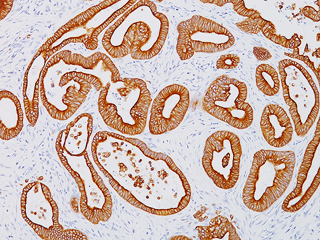
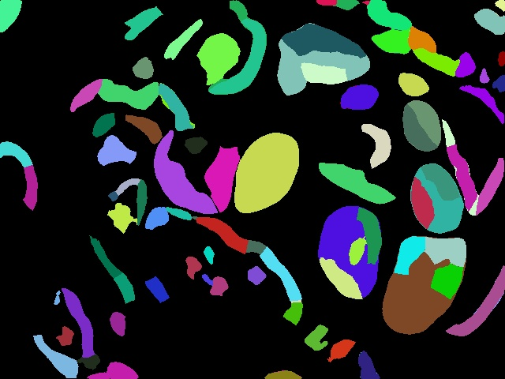
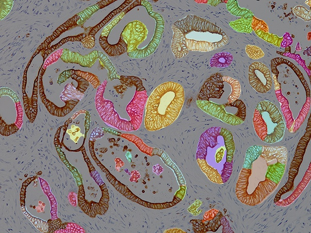

# SignCellAndGetData

SignCellAndGetData is a Python-based project that performs cell segmentation and analysis on a set of images. This project utilizes the Cellpose algorithm for segmentation and calculates various cell properties like area, circularity, brightness, and irregularity, and saves the results to an Excel file.

## Table of Contents

- [Installation](#installation)
- [Usage](#usage)
- [Project Structure](#project-structure)
- [Arguments](#arguments)
- [Output](#output)
- [Contributing](#contributing)
- [License](#license)

## Installation

To run this project locally, you will need to clone the repository and install the required dependencies.

```bash
git clone https://github.com/mnedisko/SignCellAnalyzer
cd SignCellAndGetData
pip install -r requirements.txt
```
Ensure you have Python 3.6 or higher installed on your system.

## Usage
To perform cell segmentation and analysis, run the main.py script with the following command:

python main.py --image_folder "path_to_images" --output_path "path_to_output_segments" --output_merge "path_to_output_merge"

Example

python main.py --image_folder "data/newdata/datas/purple_img" --output_path "data/newdata/datas/output_segments" --output_merge "data/newdata/datas/output_merge"

## Project Structure
main.py: The main script to perform cell segmentation and analysis.
requirements.txt: A list of dependencies required for the project.
## Arguments
--image_folder: The folder containing the input images. (default: data/newdata/datas/purple_img)
--output_path: The folder to save the segmented images. (default: data/newdata/datas/output_segments)
--output_merge: The folder to save the merged images. (default: data/newdata/datas/output_merge)
## Output
The output includes:

Segmented Images: Saved in the specified output_path.
Merged Images: Saved in the specified output_merge.
Excel File: An Excel file with cell properties like area, circularity, brightness, and irregularity is saved in the output_path.
## Contributing
Contributions are welcome! Please fork the repository, create a new branch for your feature or bugfix, and submit a pull request.

## License
This project is licensed under the MIT License. See the LICENSE file for more details.

## Example Images


--



--


